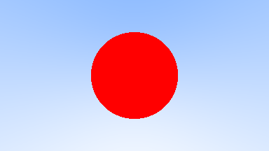
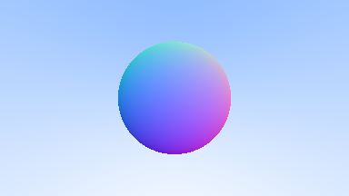

# Learning Rust Part 4: Rays

> 📚 Series: [Part 1](https://github.com/lopossumi/Rust-Hello) - [Part 2](https://github.com/lopossumi/Rust-Output-Image) - [Part 3](https://github.com/lopossumi/Rust-Vectors)

In the previous session we created some 3D vectors, which can be used to mark a position or distance in space. For ray tracing, we'll of course need rays. 

## Type aliases

Rays have a point of origin and a direction which could both be represented as ```Vec3```s, but let's create a ```type alias``` for the point of origin just for practice. We can also create an alias for ```Color``` in RGB space, ranging from black (0, 0, 0) to white (1, 1, 1):

```rust
// vectors.rs
...
pub type Point3 = Vec3;
pub type Color = Vec3;

#[derive(Clone, Copy)]
pub struct Vec3 {
    pub x: f64,
    pub y: f64,
    pub z: f64,
}
```
These aliases can now be used interchangeably with ```Vec3``` (the compiler doesn't even mind if we accidentally mix them), so let's try them out in our ```Ray``` definition. Creating a new file called ```ray.rs``` and importing the vector stuff (imports were done with ```mod```, right?) we'll start with the following definition:

```rust
mod vector;
use vector::*;

pub struct Ray {
    origin: Point3,
    direction: Vec3,
}
```
Squiggly lines again? The compiler doesn't quite understand what we're doing, but it's trying its best to help.
```
> Executing task: cargo build <

   Compiling rays v0.1.0 (D:\RustProjects\rays)
error[E0583]: file not found for module `vector`
 --> src\ray.rs:1:1
  |
1 | mod vector;
  | ^^^^^^^^^^^
  |
  = help: to create the module `vector`, create file "src\ray\vector.rs"

error[E0412]: cannot find type `Point3` in this scope
 --> src\ray.rs:5:13
  |
5 |     origin: Point3,
  |             ^^^^^^ not found in this scope
  |
help: possible candidate is found in another module, you can import it into scope
  |
2 | use crate::vector::Point3;
  |
```
Right, so we already have the module? According to the compiler we can now import it into local scope with ```use crate::vector```. Let's try:
```rust
use crate::vector::*;

pub struct Ray {
    origin: Point3,
    direction: Vec3,
}
```
That works. Then all we need are a function for the white-to-blue color gradient and another to determine a point at a distance from the origin. Let's add a constructor, too, although I'm not sure how idiomatic Rust that is. I'm sure the code will get more *rustic* over time.
```rust
impl Ray {
    pub fn new(origin: Point3, direction: Vec3) -> Ray {
        Ray { 
            origin: origin, 
            direction: direction 
        }
    }

    pub fn at(&self, distance: f64) -> Point3 {
        self.origin + distance * self.direction
    }

    pub fn color(&self) -> Color {
        let unit_direction = self.direction.unit_vector();
        let t = 0.5 * (unit_direction.y + 1.0);

        (1.0 - t) * Color::new(1.0, 1.0, 1.0) + t * Color::new(0.5, 0.7, 1.0)
    }
}
```
The main function is getting rather busy as we need to define the scene.
```rust
use image::{ImageBuffer, Rgb, RgbImage};

mod ray;
mod vector;
mod sphere;

use ray::Ray;
use vector::Vec3;

fn main() {
    const ASPECT_RATIO: f64 = 16.0 / 9.0;
    const IMAGE_WIDTH: u32 = 384;
    const IMAGE_HEIGHT: u32 = (IMAGE_WIDTH as f64 / ASPECT_RATIO) as u32;

    let viewport_height = 2.0;
    let viewport_width = ASPECT_RATIO * viewport_height;
    let focal_length = 1.0;

    let origin = Vec3::new(0.0, 0.0, 0.0);
    let horizontal = Vec3::new(viewport_width, 0.0, 0.0);
    let vertical = Vec3::new(0.0, viewport_height, 0.0);
    let lower_left_corner =
        origin - horizontal / 2.0 - vertical / 2.0 - Vec3::new(0.0, 0.0, focal_length);

    let mut buffer: RgbImage = ImageBuffer::new(IMAGE_WIDTH, IMAGE_HEIGHT);
    for (x, y, pixel) in buffer.enumerate_pixels_mut() {
        let u = x as f64 / (IMAGE_WIDTH - 1) as f64;
        let v = 1.0 - (y as f64 / (IMAGE_HEIGHT - 1) as f64);
        let ray = Ray::new(
            origin,
            lower_left_corner + u * horizontal + v * vertical - origin,
        );
        let color = ray.color().to_rgb();
        *pixel = Rgb(color);
    }

    match buffer.save("sky.png") {
        Err(e) => eprintln!("Error writing file: {}", e),
        Ok(()) => println!("Done."),
    };
}
```
Result: a nice blue sky.


## First rays

Spheres represent physical objects, so it makes sense to create a separate struct for them. Refer to [Peter's material](https://raytracing.github.io/books/RayTracingInOneWeekend.html#addingasphere) to grok the hitting part.

```rust
use crate::vector::*;
use crate::ray::*;

pub struct Sphere {
    center: Vec3,
    radius: f64,
}

impl Sphere {
    pub fn new(center: Vec3, radius: f64) -> Sphere {
        Sphere { 
            center: center, 
            radius : radius
        }
    }
    
    pub fn hit(&self, ray: &Ray) -> bool {
        let oc = ray.origin - self.center;
        let a = ray.direction.dot(ray.direction);
        let b = 2.0 * oc.dot(ray.direction);
        let c = oc.dot(oc) - self.radius * self.radius;
        let discriminant = b * b - 4.0 * a * c;
        
        discriminant > 0.0
    }
}
```
It doesn't really make much sense to create the ```Sphere``` inside the ```Ray```'s color function, but we'll fix that later.
```rust
    pub fn color(&self) -> Color {
        let sphere = Sphere::new(Vec3::new(0.0, 0.0, -1.0), 0.5);
        if sphere.hit(self) {
            return Color::new(1.0, 0.0, 0.0)
        };
        
        let unit_direction = self.direction.unit_vector();
        let t = 0.5 * (unit_direction.y + 1.0);

        (1.0 - t) * Color::new(1.0, 1.0, 1.0) + t * Color::new(0.5, 0.7, 1.0)
    }
```
Result: a variation of the flag of Japan.



After adding the coloring based on surface normals and simplifying the related equations we get the final sphere before adding more stuff to collide with:



## Traits and hittable objects

WIP